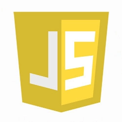
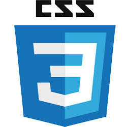
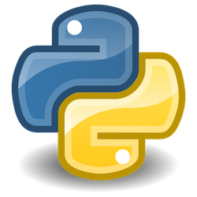
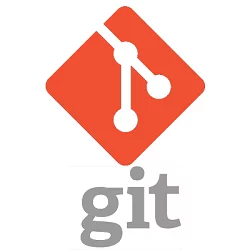

# Yana Kalenik - Junior Frontend Developer
🗺️ Wroclaw, Poland | 📧 onigiri2387@gmail.com | 💻 [github.com/ykalenik](https://github.com/ykalenik)

## Summary
I'm a self-taught Junior Developer looking for a full-time position. I started learning programming from Python in 2021 on JetBrains Academy and switched to learning frontend technologies in 2022.

I have solid soft skills because I was a librarian and worked with different people on daily basis, organizing all kinds of social events, resolving conflicts etc.

My goal is to find an interesting project and apply my skills to make something cool.

## Skills
During my work I had a chance to work with the following technologies:

|   |   |   |
|---|---|---|
|  |  |  |
|  |  |  |

## Experience 
Websites:
* Barlog-tech - a landing page for a metal workshop business (website was created using Tailwindcss and JavaScript)

Educational Projects:
* "Birthday card"
* "Carusiel from movies"
* "Unit converter"
* "Counter"
* "Representing page of yourself"

## Education
* Scrimba - The Frontend Developer Career Path (Feb 2022 - present)
* JetBrains Academy - Python track (2021 - 2022)
* Belarusian State University - Culturologist-researcher, teacher (2008 - 2012)

## English level
I am constantly improving my English by taking courses on British Council and taking part in our local English Speaking club on regular basis.

I'm sure that my English level is **A2+**.